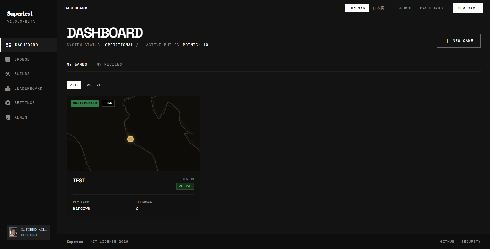
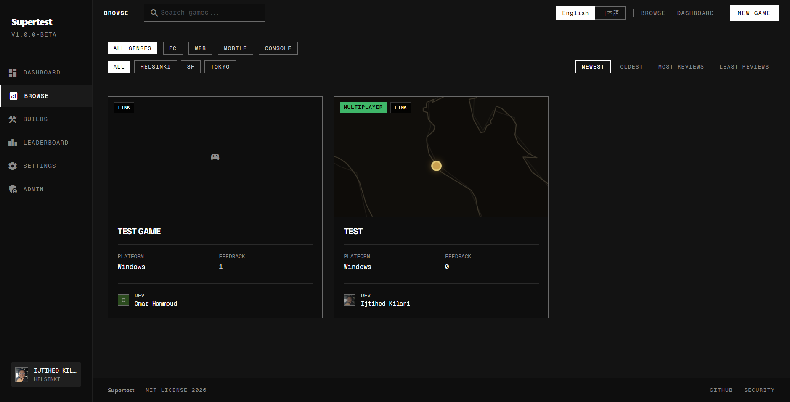
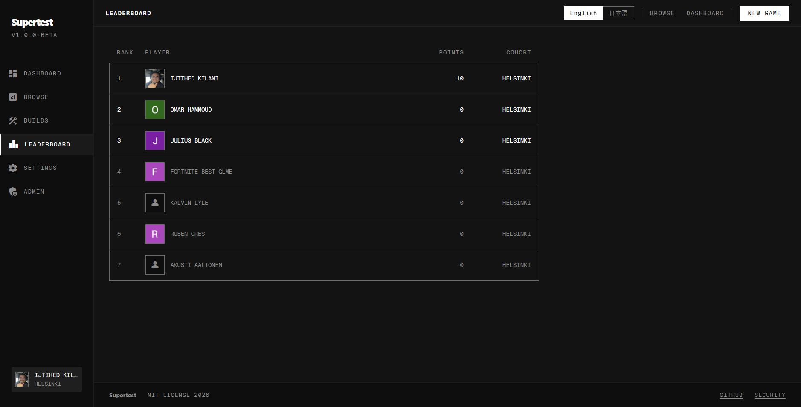

<div align="center">

# superTest

### Playtesting infra

<p>
  Upload builds, trade feedback, collect bugs and get testers.
</p>

<p>
  <a href="package.json">
    
  </a>
  <a href="LICENSE">
    
  </a>
  <a href="https://nextjs.org">
    
  </a>
  <a href="https://supabase.com">
    
  </a>
</p>

<p>
  
  
  
  
</p>

</div>

---

## Ship builds, farm feedback, fix faster

superTest is a playtesting platform for game developers.

Drop in your build link, invite testers, collect structured reviews, surface bugs, attach video proof, generate AI summaries, and reward people for actually reviewing games.

Built by [@ijtihedk](https://github.com/Ijtihed).

> The deployed instance is for the Supercell AI Lab cohort only.  
> Sign in with Google, enter your Supercell email, then DM `@ijtihedk` on Slack to get approved.

> The code is MIT licensed.  
> Fork it, deploy your own instance, swap branding, change the questions, adjust the access model, and run it for your own team, studio, class, jam, or cohort.

---

## Why this exists

Playtesting usually breaks down into the same mess every time.

- Build links buried in chat
- Feedback scattered across DMs and docs
- Bugs reported with no context
- No incentive to review other people’s games
- No clean way to compare responses across testers

superTest turns that into one loop.

1. Developers post builds
2. Testers play and submit structured reviews
3. Owners get clean results, charts, raw comments, and exportable data
4. Reviewers earn points and climb the leaderboard

---

## Core loop

| Step | What happens |
|---|---|
| Publish | Share an itch.io, Drive, or web build with cover, genre, platform, and cohort |
| Review | Collect ratings, bugs, custom questions, video links, and free text |
| Analyze | See averages, play-again rate, custom question charts, raw logs, and AI summaries |
| Motivate | Give reviewers points and show who is actually contributing |
| Control | Run public dashboards, private invites, or cohort-gated access |

---

## Screens

<div align="center">

### Dashboard

Your games, reviews, points, and activity in one place.



<br />
<br />

### Browse Games

Search and filter by platform, cohort, and genre.



<br />
<br />

### Leaderboard

Reward the people who actually test things.



</div>

---

## What you get

<table>
  <tr>
    <td valign="top" width="50%">

### For developers

- Publish builds in minutes
- Add up to 15 custom questions
- See ratings breakdowns and bug reports
- Get one click AI summaries in the browser
- Export all responses to CSV
- Keep dashboards public or private

  </td>
    <td valign="top" width="50%">

### For testers

- Fast, clear feedback form
- Structured scoring instead of random comments
- Video evidence links for proof
- Review points for every submitted review
- Public leaderboard status
- Clean browse page to find what to play next

  </td>
  </tr>
</table>

---

## Feature breakdown

### Structured feedback, not random noise

Every review can include:

- Overall rating, gameplay, visuals, and fun factor
- Bug reports
- Play-again probability
- Video links, YouTube or Loom
- Free text feedback
- Up to 15 custom questions set by the game owner

### Results dashboard that actually helps

For every game, owners get:

- Response count
- Average ratings
- Average fun score
- Play-again percentage
- Charts for custom questions
- Full feedback log with relative timestamps
- CSV export
- AI summary generated locally in the browser

### Review economy

Every submitted review gives `+10 points`.

That means people are pushed to test other games instead of only posting their own. The leaderboard makes contribution visible.

### Access control built in

- Google sign in
- Cohort email onboarding
- Admin approval flow
- Pending and rejected states
- Private invite links for specific games
- Admin search, approve, reject, and bulk approve

### Built to be forked

Nothing important is hardcoded to one team.

You can swap:

- branding
- cohorts
- questions
- copy
- locale strings
- access rules
- admin flow

---

## Tech stack

| Layer | Tech |
|---|---|
| Framework | Next.js 16, App Router, TypeScript |
| Auth | Supabase Auth, Google OAuth |
| Database | Supabase PostgreSQL, Row Level Security |
| Storage | Supabase Storage for cover images |
| Styling | Tailwind CSS v4, Monolith Protocol |
| i18n | English and Japanese, localStorage persistence |
| Testing | Vitest and React Testing Library |
| CI | GitHub Actions, lint, typecheck, test, build |

---

## Routes

`20 routes total`

| Route | Access | Purpose |
|---|---|---|
| `/` | Public | Landing page |
| `/security` | Public | Security and privacy breakdown |
| `/onboarding` | Auth | Cohort and Supercell email setup |
| `/pending` | Auth | Waiting for approval |
| `/rejected` | Auth | Account rejected |
| `/dashboard` | Approved | Your games, reviews, and points |
| `/games` | Approved | Browse public games |
| `/games/new` | Approved | Create a new game |
| `/games/[id]` | Approved | Game detail page |
| `/games/[id]/edit` | Owner | Edit game |
| `/games/[id]/feedback` | Approved | Submit feedback |
| `/games/[id]/results` | Owner | Results dashboard, AI summary, CSV export |
| `/leaderboard` | Approved | Reviewer rankings |
| `/profile/[id]` | Approved | User profile and stats |
| `/admin` | Admin | User approval and management |
| `/settings` | Approved | Language, cohort, account |
| `/invite/[code]` | Approved | Private invite resolver |

---

## Quick start

```bash
git clone https://github.com/Ijtihed/supertest.git
cd supertest
npm install
cp .env.local.example .env.local
```

Fill in your Supabase URL and anon key.

Then run the SQL files in Supabase:

```txt
supabase/schema.sql
supabase/add_cohort.sql
supabase/add_admin_and_points.sql
```

Enable Google Auth in Supabase and set the callback URL:

```txt
http://localhost:3000/auth/callback
```

Make yourself admin:

```sql
UPDATE public.profiles
SET status = 'approved', is_admin = true
WHERE id = 'YOUR_USER_ID_HERE';
```

Run locally:

```bash
npm run dev
```

---

## Project structure

```txt
src/
├── app/
│   ├── admin/
│   ├── auth/
│   ├── dashboard/
│   ├── games/
│   ├── leaderboard/
│   ├── onboarding/
│   ├── pending/
│   ├── profile/
│   ├── security/
│   └── settings/
├── components/
│   ├── admin/
│   ├── auth/
│   ├── dashboard/
│   ├── feedback/
│   ├── games/
│   ├── layout/
│   ├── leaderboard/
│   ├── onboarding/
│   ├── profile/
│   ├── settings/
│   └── ui/
├── lib/
│   ├── actions/
│   ├── auth/
│   ├── i18n/
│   ├── queries/
│   ├── supabase/
│   ├── toast/
│   ├── types/
│   └── utils/
├── __tests__/
└── middleware.ts
```

---

## Scripts

| Command | What it does |
|---|---|
| `npm run dev` | Start dev server |
| `npm run build` | Production build |
| `npm run start` | Start production server |
| `npm run test` | Test watch mode |
| `npm run test:run` | Single test run |
| `npm run lint` | Run ESLint |

---

## Security summary

Full breakdown lives at [`/security`](src/app/security/page.tsx).

- Google OAuth via Supabase
- HTTP only session cookies
- Row Level Security on all tables
- Parameterized Supabase queries, no raw application SQL
- 5MB image upload limit with file type checks
- Admin approval gate for protected routes
- Environment variables for secrets

Not covered yet:

- End to end encryption
- Custom rate limiting beyond Supabase defaults
- Formal pen testing
- Private storage buckets for uploaded covers

---

## Design system

superTest follows a dark, sharp, game-adjacent system.

- Backgrounds from `#131313` to `#0E0E0E`
- High contrast text and muted data tones
- Space Grotesk for headlines
- Inter for body copy
- Geist Mono for labels and metrics
- Minimal rounding
- No soft marketing fluff
- Dense product-first UI

---

## License

[MIT](LICENSE)

Use it, fork it, reskin it, deploy it.
